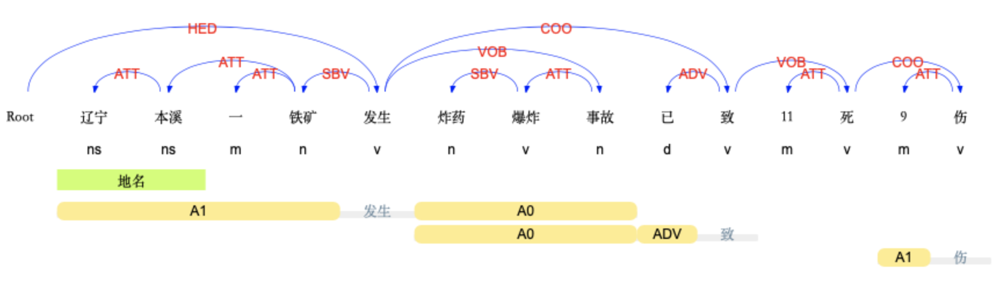

# 文本分析工具LTP使用

本文主要介绍文本分析工具LTP的使用，其中主要介绍的功能有：
1. 长文档分句
2. 句子分词
3. 词性标注
4. 命名实体识别
5. 依存句法分析
6. 语义角色标注

这些的功能在```tools.ltp``` 中均有实现，下面依次介绍各个部分的使用方法。具体ltp各项功能说明，以及各项标注的含义请见[ltp的官方文档](https://ltp.readthedocs.io/zh_CN/latest/appendix.html#)。下图显示ltp官方的可视化分析结果：



## 初始化工具

在使用LTP工具前需要对工具初始化，初始化的时候需要加载对应版本的ltp模型。

```
>>> import os
>>> from tools.ltp import Ltp
>>>
>>> # 初始化ltp工具
>>> ltp_tool = Ltp(os.path.join('..', 'resource', 'ltp_data_v3.4.0'))  # ltp模型存储位置 
```

以下面内容为例介绍各种功能：

```
>>> # 初始化数据
>>> doc = "“元芳体”的创意来源于古装侦探系列电视剧《神探狄仁杰》。" \
   "剧中的狄公经常征求助手李元芳的意见，从而借对话引出对案情的分析。" \
   "李元芳的标准回答有两个，一个是“大人，我觉得此事有蹊跷”，另一个是“此事背后一定有一个天大的秘密。”"
>>> sentence = "元芳你怎么看？"
```

## 长文档分句

输入一个长文档，使用LTP工具将文档分为多个句子。

```
>>> # 长文档分句
>>> split_out = ltp_tool.split(doc)
>>> print('\n'.join(split_out))
“元芳体”的创意来源于古装侦探系列电视剧《神探狄仁杰》。
剧中的狄公经常征求助手李元芳的意见，从而借对话引出对案情的分析。
李元芳的标准回答有两个，一个是“大人，我觉得此事有蹊跷”，另一个是“此事背后一定有一个天大的秘密。
```

## 句子分词

将句子进行分词，该功能也支持文档的分词。

```
>>> # 句子分词
>>> segment_out = ltp_tool.segment(sentence)
>>> print(' '.join(segment_out))
元芳 你 怎么 看 ？
```

## 词性标注

对句子的各个词语的词性进行标注，在进行标注前需要先将句子进行分词，即需要输入ltp的分词结果。

```
>>> # 词性标注
>>> postag_out = ltp_tool.postag(segment_out)
>>> print(' '.join(postag_out))
nh r r v wp
```

## 命名实体识别

对句子中的词语进行标注，说明是否是命名实体，需要输入ltp的分词结果和词性标注结果。

```
>>> # 命名实体识别
>>> recognize_out = ltp_tool.recognize(segment_out, postag_out)
>>> print(' '.join(recognize_out))
S-Nh O O O O
```

### 依存句法分析

对句子的依存句法结果进行分析，需要输入ltp的分词结果和词性标注结果。

``` 
>>> # 依存句法分析
>>> parse_out = ltp_tool.parse(segment_out, postag_out)
>>> print("\t".join("%d:%s" % (arc.head, arc.relation) for arc in parse_out))
4:SBV	4:SBV	4:ADV	0:HED	4:WP
```
## 语义角色标注

对句子的语义角色进行标注，需要输入ltp的分词结果、词性标注结果和依存句法分析结果。
```
>>> # 语义角色标注
>>> label_out = ltp_tool.label(segment_out, postag_out, parse_out)
>>> print("-----{}-----".format(" 语义角色标注 "))
>>> for role in label_out:
>>>     print(role.index, "".join(\
            ["%s:(%d,%d)" % (arg.name, arg.range.start, arg.range.end) for arg in role.arguments]))
3 A0:(1,1)ADV:(2,2)
```

## 获取句子中特定的命名实体集

将ltp的命名实体结果进行整理，返回特定类别命名实体的检索结果。

``` 
>>> # 获取句子中特定的命名实体集
>>> ne = ltp_tool.get_name_entity(sentence, "Nh")  # 获取人名
>>> print(' '.join(ne))
元芳
```


## 模型释放
``` 
>>> # 模型释放
>>> ltp_tool.release()
```


